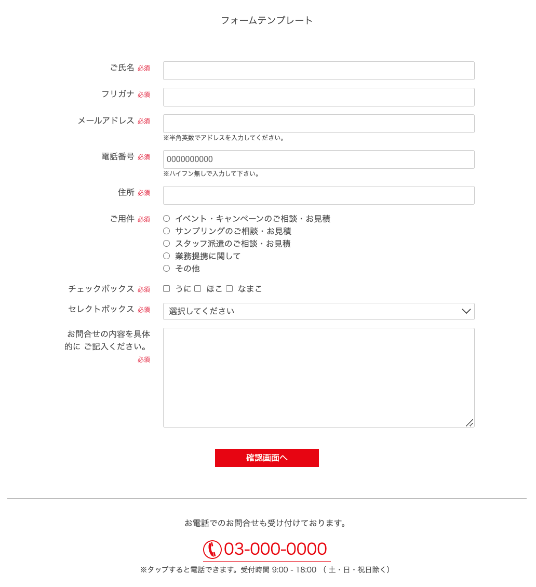

# mymailform
## メールフォーム一式

  
|ファイル|内容
|--|--
|index.html | TOPページ、入力フォーム
|confilm.php | バリデーション設定、確認画面
|sendmail.php | メール送信設定
|thanks.html | 送信完了ページ
|404.html | リファラーチェックで弾かれた行き先
|style.css | フォームページCSS
|tel_icon.svg | アイコン画像

### <strong>仕様</strong>
1.入力 - index.html 
2.確認 - confilm.phpでエラーチェック 
- エラー有りの場合は戻るボタンのみ
- エラー無しの場合は送信ボタン表示

3.完了 - sendmail.phpを通してメール送信後サンクスページへ
